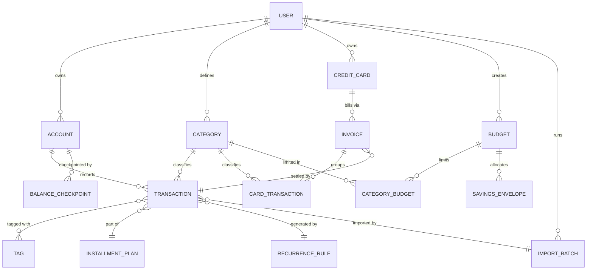

# Domain Model, Glossary & Cross-Cutting Conventions

> **Mirrored file** — identical copy exists in `mybills-backend` and `mybills-frontend`. Edit both when this
> changes. Unscoped — loads every session. Full spec reference: `MyBills-Technical-Specification.md` §4, §8.

## Entity Relationship Diagram

## Key entities & notable attributes

- **TRANSACTION** — `id`, `user_id`, `account_id`, `category_id`, `type` (income \| expense), `status` (paid \|
  pending), `date`, `amount_minor`, `currency_code`, `description`, `is_fixed`, `is_ignored`,
  `installment_plan_id?`, `recurrence_rule_id?`, `import_batch_id?`, `fingerprint`, soft-delete fields, audit
  fields.
- **ACCOUNT** — `id`, `user_id`, `name`, `bank_logo`, `initial_balance_minor`, `currency_code`.
- **BALANCE_CHECKPOINT** — `account_id`, `period_end` (month), `closing_balance_minor`, `is_stale`. (Introduced
  only when AD-2 optimization is enabled.)
- **CREDIT_CARD** — `id`, `user_id`, `name`, `credit_limit_minor`, `closing_day`, `due_day`.
- **INVOICE** — `id`, `credit_card_id`, `cycle_start`, `cycle_end`, `due_date`, `status` (open \| closed \|
  paid), `settled_transaction_id?`.
- **CARD_TRANSACTION** — split from TRANSACTION because it settles into an invoice, not the account ledger.
  Available limit = `credit_limit − open-invoice balance`.
- **BUDGET** — `id`, `user_id`, `period_type` (monthly \| custom), `period_start`, `period_end`,
  `planned_income_minor`, `savings_percent`.
- **CATEGORY_BUDGET** — `budget_id`, `category_id`, `limit_minor` (or percent).
- **SAVINGS_ENVELOPE** — `budget_id`, `name`, `allocation_minor`. Allocation, **not** a transaction,
  in v1.
- **IMPORT_BATCH** — see `mybills-backend`'s `import-subsystem.md`.

Note for `mybills-frontend`: these entities are the backend's schema, not necessarily this repo's local types.
This ERD exists here so frontend work never has to guess at relationships when designing views — actual
request/response shapes belong in `api-contract.md`, which may differ slightly from the raw schema (e.g. joined
fields, computed figures included in a response).

## Gotchas (non-obvious from field names alone — scan this before touching these areas)

- Credit card purchases never touch account balance — they accrue to the open `INVOICE`, and paying an invoice
  creates exactly **one** bridge transaction into the account ledger. Don't conflate `CARD_TRANSACTION` with
  `TRANSACTION`.
- `SAVINGS_ENVELOPE` doesn't move money or hit the ledger.
- `is_ignored` is a **display filter**, not a soft-delete — stays in the ledger so balances reconcile.
- Budgets are **stored snapshots**: the spending-budget formula is computed once at creation; only the *actuals*
  are live. Don't recompute the plan when transactions change.
- Balance adjustments are audited `TRANSACTION` rows, never a direct rewrite of `initial_balance`.

## Terminology (standardized to English, used as-is in product & code, on every client)

| Term | Meaning |
|---|---|
| Current Balance | Balance from paid transactions only, dated ≤ today |
| Projected Balance | Balance from paid + pending transactions |
| Projected Expenses | Upcoming/pending expenses not yet paid |
| Fixed Expense | Recurring expense obligation |
| Installment Plan | A purchase split into N materialized payments |
| Budgets | The budget/planning module |
| Savings Envelope | A named allocation within a budget (not a real transfer in v1) |
| Invoice | Credit card statement cycle |

**Note on naming history:** the product was originally specified with Portuguese-origin terminology (Saldo
atual, Saldo previsto, Despesa fixa, Parcelamento, Planejamento, Caixinha, Fatura). The whole project —
documentation, code, and UI — has since been standardized to English throughout. If any existing UI mockups or
screenshots referenced in the spec still show the old Portuguese labels, treat those as needing an equivalent
update; they are visual assets outside what these rule files can change directly.

## Cross-Cutting Rules (apply everywhere, backend or any client)

- **Money:** integer minor units + `currency_code`; no floats — in storage, computation, or client-side display
  formatting. (AD-4)
- **Dates/timezone:** a single fixed timezone defines month boundaries; transactions bucket by their `date`.
- **Soft-delete + audit:** financial records are soft-deleted with audit fields; history is not silently
  rewritten.
- **No client computes a balance, invoice total, or budget actual itself.** Every figure is rendered from what
  the backend returns.
- **Don't silently resolve ambiguity** (dates, dedup matches, category assignment) — surface it to the user.
