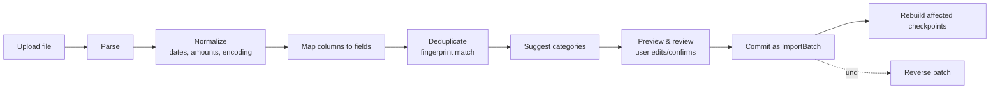

# Import Subsystem (CSV / PDF)

> Full spec reference: `MyBills-Technical-Specification.md` §6. This is the highest-risk subsystem in the whole
> backend.

## Governing rule

**Never auto-commit.** Always: parse → preview → human-confirm → reversible commit. Nothing an import produces
touches the ledger without passing through the review screen.

## Source honesty

- **CSV** — well-supported, structured, the recommended path.
- **PDF** — best-effort, review-mandatory. Text-extractable PDFs use table extraction; scanned PDFs fall back to
  OCR. Both are inherently unreliable, so **every** PDF row passes through the same mandatory review screen with
  a per-row confidence indicator, and low-confidence rows are highlighted. Framed to the user as "assisted
  entry," never "automatic" — this is a product-honesty requirement, not just a UI copy detail.

## Pipeline

1. **Upload** — validate MIME type and size; treat the file as untrusted (see `security-and-multitenancy.md`).
2. **Parse** — CSV: detect delimiter and encoding. PDF: text-layer extraction, fall back to OCR for scanned
  pages.
3. **Normalize** — the highest bug-density step:
  - **Dates:** resolve `DD/MM/YYYY` vs `MM/DD/YYYY` explicitly — default to the user's locale, surface the
  assumption in preview, flag ambiguous dates rather than guess silently.
  - **Amounts:** handle European (`1.234,56`) vs. US (`1,234.56`) formatting; map debit/credit conventions
  (sign column, separate debit/credit columns, or parentheses) to `type`.
  - **Encoding:** detect UTF-8 vs. Latin-1; correct mojibake before it reaches the description.
4. **Map** — bind source columns to fields; save the mapping as a reusable **bank profile** so the same bank's
  exports auto-map next time.
5. **Deduplicate** — `fingerprint = hash(account_id, date, amount_minor, normalized_description)`, compared
  against existing transactions *and* other rows in the same file. Matches are flagged as **likely duplicate,
  skipped by default but overridable** — never silently dropped (two genuinely identical €5 coffees on the
  same day is a legitimate case).
6. **Suggest categories** — rule-based inference from description (e.g. "Tesco" → Supermarket), user confirms.
  No silent assignment.
7. **Preview & review** — editable table with dedup flags, confidence indicators, target account/card binding.
  Commit is disabled until required fields are valid. The exact preview response shape belongs in
  `api-contract.md`.
8. **Commit** — create `IMPORT_BATCH`, insert all confirmed transactions carrying `import_batch_id`.
9. **Rebuild checkpoints** — imports are the dominant real-world source of back-dated writes (AD-2). Commit
  triggers a forward checkpoint rebuild from the earliest imported date.
10. **Reverse** — "Undo import" soft-deletes the entire batch's transactions and rebuilds checkpoints.

## IMPORT_BATCH entity

`id`, `user_id`, `source_type` (csv \| pdf), `original_filename`, `account_id` / `credit_card_id`,
`bank_profile_id?`, `row_count`, `imported_count`, `skipped_count`, `status` (parsing \| review \| committed \|
reversed \| failed), `created_at`. Every transaction created via import carries `import_batch_id`, making the
whole batch atomic and reversible.

## Processing model

Synchronous is acceptable at personal scale. PDF/OCR can be slow for large files, so keep the batch as a
first-class entity with a `status` field — this lets the work move to a background job later **without
changing the data model or the UX** (preview loads once status reaches `review`).

## Acceptance criteria

- Re-importing an overlapping statement creates **zero** duplicate transactions under default dedup behavior.
- No import ever writes to the ledger without passing through the review screen.
- Undoing any import returns all balances to their pre-import values exactly.
- After any committed import, `Σ(ledger)` still reconciles with every displayed balance.
- A saved bank profile auto-maps a subsequent export from the same bank with no manual column mapping.
