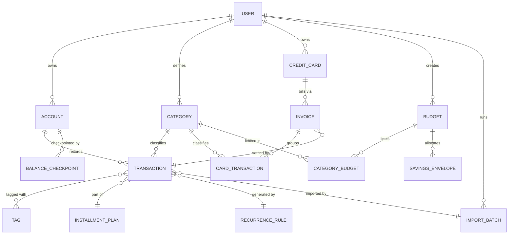
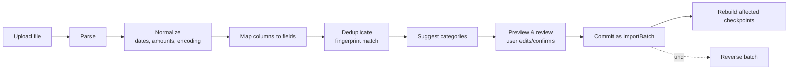

# MyBills — Technical Specification

**Status:** Draft v1 (pre-implementation)
**Scope:** Personal finance web app, single-user first, designed to scale to multi-tenant
**Language of product:** English (UI). Currency: EUR (v1).

---

## 1. Overview & Goals

MyBills is a personal finance web application for tracking accounts, transactions, credit cards, budgets, and reports. The defining product decision is that **the transaction ledger is the single source of truth**; every balance, total, chart, and budget figure is *derived* from it rather than stored and mutated independently.

**Primary goals**
- A correct, auditable ledger where balances always reconcile to recorded transactions.
- Fast monthly views (dashboard, transactions, reports) that stay fast as history grows.
- Frictionless data entry, including **bulk import from bank statements (CSV and PDF)**.

**Operating stance:** built as a personal app now, but every design decision that is *expensive to retrofit* for multi-user is made up front (notably tenant scoping). Decisions that are cheap to add later (real auth, billing, per-tenant infra) are deferred.

**Non-goals (v1):** real multi-currency with FX conversion, investment/asset tracking, shared/household accounts, mobile-native apps, bank API/Open Banking connections.

---

## 2. Architecture Summary

| Concern | Decision | Rationale |
|---|---|---|
| Application shape | **Modular monolith** | No scaling or team-boundary pressure justifies microservices; financial logic benefits from in-process transactional consistency. |
| Database | **PostgreSQL** | Highly relational data with strict integrity needs and heavy `GROUP BY`/`SUM` aggregations (by category, by month). |
| API | **REST** | Single first-party client; GraphQL/gRPC unjustified. |
| Frontend | **React SPA** | Interaction-heavy dashboards and modals. |
| Money | **Integer minor units (cents) + `currency_code`** | Never floating point. Currency code stored even though EUR-only, to leave the door open. |

**Internal module seams** (the boundaries to respect even inside one deployable):
`Accounts/Ledger` · `Transactions` · `Credit Cards` · `Budgets` · `Categories` · `Import`.

---

## 3. Core Architectural Decisions

These are summarized here; each warrants a standalone ADR in the repo.

### AD-1 — Derived ledger (source of truth)
Accounts store only an `initial_balance`. All balances are computed from the ledger:
- **Current Balance (current balance)** = `initial_balance + Σ(paid transactions with date ≤ today)`
- **Projected Balance (projected balance)** = `initial_balance + Σ(paid + pending transactions)`
- **End-of-day balance** = the same sum evaluated at a given date.

Rejected alternative: a mutable `balance` column incremented per insert. It is corrupted by edits, deletions, back-dated entries, and pending/paid changes, and cannot reproduce the running "end-of-day balance" lines shown in the transactions view.

### AD-2 — Balance function seam + deferred checkpoints
All balance reads go through a **single function** `getAccountBalance(account, date, {projected})`. No screen sums transactions on its own.

Initially this function computes the pure derivation from AD-1. When read latency appears at scale, the function internally switches to **month-end checkpoints**: one stored closing balance per account per month, so the live equation becomes `nearest checkpoint + Σ(transactions since that checkpoint)` — bounded to roughly one month of rows. Callers are unaware of which path produced the number, and both paths can be run in parallel and asserted equal to catch checkpoint bugs.

**Trade-off (must be recorded):** a back-dated write invalidates all checkpoints after its date and triggers a forward rebuild from that month. Acceptable because most writes land near "today"; **import is the main exception** (see §6).

### AD-3 — Tenant scoping from day one
Every table carries an owner key (`user_id`), enforced in every query, ideally backed by Postgres **row-level security**. This is the one piece that is genuinely painful to retrofit (risk: one user seeing another's balances), so it is adopted immediately even while auth/billing are deferred.

### AD-4 — Money representation
All monetary amounts stored as **integer minor units** with an accompanying `currency_code`. No floats anywhere in storage or computation.

### AD-5 — Installments vs recurring are separate mechanisms
- **Installments** (installment plan): one purchase sliced into N payments. All N transactions are **materialized at creation**, linked by `installment_plan_id` + sequence index, each independently payable, each labelled `[i/N]` (e.g. `Student loan(5/8)`).
- **Recurring fixed expenses** (fixed expense): N independent obligations of the full amount, driven by a `RecurrenceRule`, **lazily generated** per month (no infinite materialization). End is **optional** (count, end-date, or indefinite). They enter as *projected expenses* until paid.

---

## 4. Domain Model

**Key entities & notable attributes**

- **TRANSACTION** — `id`, `user_id`, `account_id`, `category_id`, `type` (income | expense), `status` (paid | pending), `date`, `amount_minor`, `currency_code`, `description`, `is_fixed`, `is_ignored` (the "Ignore Transaction" toggle), `installment_plan_id?`, `recurrence_rule_id?`, `import_batch_id?`, `fingerprint`, soft-delete fields, audit fields.
- **ACCOUNT** — `id`, `user_id`, `name`, `bank_logo`, `initial_balance_minor`, `currency_code`.
- **BALANCE_CHECKPOINT** — `account_id`, `period_end` (month), `closing_balance_minor`, `is_stale`. (Introduced only when AD-2 optimization is enabled.)
- **CREDIT_CARD** — `id`, `user_id`, `name`, `credit_limit_minor`, `closing_day`, `due_day`.
- **INVOICE** — `id`, `credit_card_id`, `cycle_start`, `cycle_end`, `due_date`, `status` (open | closed | paid), `settled_transaction_id?`.
- **CARD_TRANSACTION** — split from TRANSACTION because it settles into an invoice, not the account ledger. Available limit = `credit_limit − open-invoice balance`.
- **BUDGET** — `id`, `user_id`, `period_type` (monthly | custom), `period_start`, `period_end`, `planned_income_minor`, `savings_percent`.
- **CATEGORY_BUDGET** — `budget_id`, `category_id`, `limit_minor` (or percent).
- **SAVINGS_ENVELOPE** — `budget_id`, `name`, `allocation_minor`. Treated as an allocation, **not** a transaction, in v1.
- **IMPORT_BATCH** — see §6.

---

## 5. Functional Requirements by Module

The visual layout is defined by the provided screenshots and is not re-described here. This section specifies **behavior, rules, and acceptance criteria** — the parts not visible in a mockup.

### 5.1 Dashboard
- Header KPIs (Current Balance, Income, Expenses, Credit Card) are all derived for the **selected month**.
- Income/Expenses pie charts group transactions by category for the month, excluding `is_ignored` transactions.
- **Monthly Savings** compares the month's savings (income − expenses) to the previous month and reports both an absolute figure and a percent of income.
- **AC:** changing the month badge re-derives every figure on the page from the ledger for that month; no figure is read from a stored running total.

### 5.2 Accounts
- Each account shows **Current Balance** and **Projected Balance** via `getAccountBalance` (AD-1/AD-2).
- Right-side aggregates are the sum across all of the user's accounts.
- Per-account actions: edit, delete, **adjust balance**.
- **Adjust balance** must create an explicit *balance-adjustment transaction* (an audited reconciliation entry), **not** silently rewrite `initial_balance`. This keeps the ledger reconciling. **AC:** after an adjustment, `Σ(ledger)` still equals the displayed balance.
- Deleting an account with transactions requires an explicit decision (block, or soft-delete with its transactions); define before build.

### 5.3 Transactions
- Filters: type (expense | income | all), free-text search (description or amount), and the funnel (category, date range/specific date, accounts).
- Header badges (Current Balance, Income, Expenses, Monthly Balance) reflect the **active filters** for the selected month.
- Running **"end-of-day balance"** lines are cumulative (AD-1) and rendered via the balance function, not from filtered sums.
- Per-row actions: edit, delete, toggle status (paid | pending).
- Value colored red (expense) / green (income).
- **AC:** toggling a transaction's status updates Current Balance vs Projected Balance consistently with AD-1.

### 5.4 Credit Cards
- A card purchase **does not** move account balance; it accrues to the **open invoice** for the billing cycle defined by `closing_day → due_day`.
- **Available Limit** = `credit_limit − open-invoice balance`.
- Paying an invoice creates **one** expense transaction in the chosen account (the bridge to the account ledger) and marks the invoice `paid`.
- Edge cases to pin down explicitly: partial payments, purchases dated near the closing day (which cycle they fall into), refunds/credits.

### 5.5 Budgets
- Toggle monthly | custom period; custom periods break the "everything filters by month" assumption — period model must be explicit.
- Right-side badges: month income, planned spend, planned balance, planned savings %.
- **Creation flow:** planned income (with the last-3-months average shown as a hint) → savings % → optional **savings envelopes** (named allocations of the income) → highlighted summary badge showing the computed spending budget and per-envelope savings → next step: optional per-category limits (by € or %), skippable per-category or entirely.
- **Computation chain:** `spending budget = planned_income × (1 − savings%) − Σ(envelope allocations)`.
- **Active budget view:** remaining-to-spend in € and %, with a progress bar; per-category table where `Total Spent = paid expenses + projected expenses` and `Remaining = limit − total spent`. Category alerts at near-limit and at limit.
- **AC:** actuals in the table are computed live from transactions in the period; the plan itself is a stored snapshot and does not change when transactions are added.

### 5.6 Reports
- Expenses pie for the selected month, grouped by category, each shown as € and % of total, ranked high→low. Pure read view over the ledger.

### 5.7 Categories
- Under Options. Create/edit/delete categories with name, icon, color, type (expense | income).
- Deleting a category in use requires a reassignment or block rule; define before build.

### 5.8 New Transaction modal
- Amount field with calculator helper; paid/pending toggle; payment date; description; category; account; tags; **fixed expense** (→ recurring, §AD-5); **installment** (→ N materialized rows with `[i/N]` labels, §AD-5); income mirrors expense in green.
- "Ignore Transaction" sets `is_ignored` (excluded from charts/budgets but retained in the ledger).

---

## 6. Data Import Subsystem (CSV / PDF)

This is the highest-risk subsystem and the most likely source of bad data, so it is designed around one principle: **never auto-commit; always parse → preview → human-confirm → reversible commit.**

### 6.1 Goals & non-goals
**Goals:** ingest bank-statement exports (CSV) and statements (PDF) into the ledger as normal transactions, with deduplication, category suggestions, and full reversibility.
**Non-goals (v1):** live bank API connections; guaranteeing correct parsing of arbitrary PDFs; auto-detecting installments/recurring from imports (v2).

### 6.2 Source support honesty
- **CSV — well supported.** Structured, parseable, the recommended path.
- **PDF — best-effort, review-mandatory.** Text-extractable PDFs are parsed via table extraction; scanned PDFs require OCR. Both are inherently unreliable, so **every PDF row passes through the same mandatory review screen with a per-row confidence indicator**, and low-confidence rows are highlighted. PDF import is explicitly framed to the user as "assisted entry," not "automatic."

### 6.3 Pipeline

Each stage:

1. **Upload** — validate type and size; treat the file as untrusted (§7).
2. **Parse** — CSV: detect delimiter and encoding. PDF: text-layer extraction, fall back to OCR for scanned pages.
3. **Normalize** — the high-bug-density step:
  - **Dates:** resolve `DD/MM/YYYY` vs `MM/DD/YYYY` ambiguity explicitly (default to the user's locale, surface the assumption in preview). Ambiguous dates are flagged, not guessed silently.
  - **Amounts:** handle European formatting (`1.234,56`) vs US (`1,234.56`); map debit/credit conventions (sign column, separate debit/credit columns, or parentheses for negatives) to `type`.
  - **Encoding:** detect UTF-8 vs Latin-1; correct mojibake before it reaches the description.
4. **Map** — bind source columns to fields (date, amount, description, type). Save the mapping as a reusable **bank profile** so the same bank's exports map automatically next time.
5. **Deduplicate** — compute a `fingerprint = hash(account_id, date, amount_minor, normalized_description)` and compare against existing transactions *and* against other rows in the same file. Matches are flagged as **likely duplicate, skipped by default but overridable** — never silently dropped, because two genuinely identical transactions can legitimately occur (e.g. two €5 coffees same day).
6. **Suggest categories** — rule-based inference from description (e.g. "Tesco" → Supermarket), user confirms. No silent assignment.
7. **Preview & review** — a table of proposed transactions with editable fields, dedup flags, confidence indicators, and a target **account/card binding**. Commit is disabled until required fields are valid.
8. **Commit** — create an `IMPORT_BATCH` and insert all confirmed transactions carrying `import_batch_id`.
9. **Rebuild checkpoints** — statements are historical, so imports are the dominant source of **back-dated writes** (AD-2). Commit triggers a checkpoint rebuild forward from the earliest imported date. This is the concrete reason checkpoints must be rebuildable.
10. **Reverse** — "Undo import" soft-deletes the entire batch's transactions and rebuilds checkpoints. Essential because parsing will sometimes be wrong.

### 6.4 IMPORT_BATCH entity
`id`, `user_id`, `source_type` (csv | pdf), `original_filename`, `account_id` / `credit_card_id`, `bank_profile_id?`, `row_count`, `imported_count`, `skipped_count`, `status` (parsing | review | committed | reversed | failed), `created_at`. Every transaction created links back via `import_batch_id`, making batches atomic and reversible.

### 6.5 Processing model
Synchronous is acceptable at personal scale. PDF/OCR can be slow for large files, so the design keeps the batch as a first-class entity with a `status` so the work can move to a **background job** later without changing the data model or the UX (preview is loaded when status reaches `review`).

### 6.6 Acceptance criteria
- Re-importing an overlapping statement creates **zero** duplicate transactions when the user accepts the default dedup behavior.
- No import ever writes to the ledger without passing through the review screen.
- Undoing any import returns all balances to their pre-import values exactly.
- After any committed import, `Σ(ledger)` still reconciles with every displayed balance.
- A saved bank profile auto-maps a subsequent export from the same bank with no manual column mapping.

---

## 7. Non-Functional Requirements

**Performance.** Monthly views must stay responsive as history grows; this is guaranteed by the balance-function seam + checkpoints (AD-2). Period figures (Income/Expenses/Balance) are naturally bounded by the month filter; cumulative figures are bounded by checkpoints.

**Security & privacy.**
- Tenant isolation enforced in every query (AD-3); ideally Postgres row-level security.
- **Uploaded files are untrusted:** validate MIME type and size, never execute, store outside any web root (object storage preferred), and apply a retention/cleanup policy. Statement contents are sensitive financial PII and must be access-controlled and, where retained, encrypted at rest.
- Standard transport encryption; auth deferred but the user boundary is present from day one.

**Reliability & correctness.**
- Ledger writes are transactional; an import commit is atomic per batch.
- The slow pure-derivation balance path remains available as an oracle to validate the fast checkpoint path.

**Maintainability.**
- Module seams (§2) respected even within the monolith.
- All balance math lives behind one function; all import logic behind the import module.

---

## 8. Cross-Cutting Rules

- **Money:** integer minor units + `currency_code`; no floats. (AD-4)
- **Dates/timezone:** a single fixed timezone defines month boundaries; transactions bucket by their `date`. Stated explicitly because it affects every screen.
- **Soft-delete + audit:** financial records are soft-deleted with audit fields; history is not silently rewritten (cf. balance adjustment §5.2, installment labels §AD-5).
- **`is_ignored`** transactions stay in the ledger (so balances reconcile) but are excluded from charts and budgets.

---

## 9. Assumptions (please confirm)

1. **EUR-only for v1**, currency code stored for future-proofing — not real multi-currency with FX.
2. **Single fixed timezone** for month boundaries; pending/future-dated transactions bucket by `date`.
3. Savings Envelopes (savings envelopes) are **allocations**, not real transfers, in v1.
4. PDF import is acceptable as **review-mandatory, best-effort** rather than fully automatic.

---

## 10. Out of Scope (v1)

Multi-currency/FX · investments & assets · shared/household accounts · native mobile apps · Open Banking / live bank connections · auto-detection of installments/recurring from imports · ML-based category inference (rule-based only in v1).

---

## 11. Open Questions

1. **Account/category deletion semantics** when records are in use (block vs reassign vs cascade soft-delete).
2. **Credit-card edge cases:** partial invoice payments, purchases on the closing day, refunds.
3. **Custom budget periods** that span partial months — exact period model and how the "month-filtered" screens reconcile with them.
4. **Bank profile sharing:** are profiles strictly per-user, or is there a shared library of common bank formats (affects multi-tenant design later)?
5. **PDF retention:** keep original statements after import, or discard post-parse? (Security vs re-processing convenience.)
